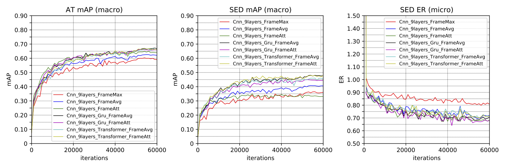

# Sound event detection of DCASE 2017 Task 4

DCASE 2017 Task 4 Large-scale weakly supervised sound event detection for smart cars consists an **audio tagging (AT)** subtask and a **sound event detection (SED)** subtask. There are over 50,000 10-second audio clips with 17 sound classes such as "Train horn" and "Car". This codebase is the PyTorch implementation of our paper **Sound Event Detection of Weakly Labelled Data with CNN-Transformer and Automatic Threshold Optimization** [1].


## DATASET
The dataset can be downloaded from https://github.com/ankitshah009/Task-4-Large-scale-weakly-supervised-sound-event-detection-for-smart-cars. After downloading, users should prepare the data looks like:

<pre>
dataset_root
├── training (51172 audios)
│    └── ...
├── testing (488 audios)
│    └── ...
├── training (1103 audios)
│    └── ...
└── metadata
     ├── groundtruth_strong_label_evaluation_set.csv
     ├── groundtruth_weak_label_evaluation_set.csv
     ├── testing_set.csv
     ├── groundtruth_strong_label_testing_set.csv
     ├── groundtruth_weak_label_testing_set.csv
     └── training_set.csv
</pre>


The log mel spectrogram of audio clips looks like:


## Run the code
**0. (Optional) Install dependent packages.**

This codebase is developed with Python3 + PyTorch 1.2.0.

Install requirements:

```
pip install -r requirements.txt
```

**1. Run ./runme.sh**

Or execute the commands in runme.sh line by line. The runme.sh includes: 

(1) Modify the paths of dataset and your workspace.

(2) Pack waveforms and targets to hdf5 file.

(3) Train.

(4) Optimize thresholds for audio tagging and sound event detection.

(5) Calculate metrics with the optimized thresholds. 

The training looks like:

<pre>
Using GPU.
Audio samples: 51172
Audio samples: 488
Audio samples: 1103
Training audio num: 51172
------------------------------------
Iteration: 0
test statistics:
   clipwise mAP: 0.083
   Write submission file to /vol/vssp/msos/qk/workspaces/transfer_to_other_datasets/transfer_to_dcase2017_task4/_tmp_submission/pytorch_main/holdout_fold=1/Cnn_9layers_FrameAvg/pretrain=False/loss_type=clip_bce/augmentation=mixup/batch_size=32/few_shots=-1/random_seed=1000/freeze_base=False/_submission.csv
   {'error_rate': 10.639028859367842, 'substitution_rate': 0.3678424186898763, 'deletion_rate': 0.0, 'insertion_rate': 10.271186440677965}
evaluate statistics:
   clipwise mAP: 0.086
   Write submission file to /vol/vssp/msos/qk/workspaces/transfer_to_other_datasets/transfer_to_dcase2017_task4/_tmp_submission/pytorch_main/holdout_fold=1/Cnn_9layers_FrameAvg/pretrain=False/loss_type=clip_bce/augmentation=mixup/batch_size=32/few_shots=-1/random_seed=1000/freeze_base=False/_submission.csv
   {'error_rate': 11.59724821133737, 'substitution_rate': 0.3594936708860759, 'deletion_rate': 0.0, 'insertion_rate': 11.237754540451293}
   Dump statistics to /vol/vssp/msos/qk/workspaces/transfer_to_other_datasets/transfer_to_dcase2017_task4/statistics/pytorch_main/holdout_fold=1/Cnn_9layers_FrameAvg/pretrain=False/loss_type=clip_bce/augmentation=mixup/batch_size=32/few_shots=-1/random_seed=1000/freeze_base=False/statistics.pickle
   Dump statistics to /vol/vssp/msos/qk/workspaces/transfer_to_other_datasets/transfer_to_dcase2017_task4/statistics/pytorch_main/holdout_fold=1/Cnn_9layers_FrameAvg/pretrain=False/loss_type=clip_bce/augmentation=mixup/batch_size=32/few_shots=-1/random_seed=1000/freeze_base=False/statistics_2019-12-06_16-09-58.pickle
Train time: 36.474 s, validate time: 71.365 s
------------------------------------
...
------------------------------------
Iteration: 50000
test statistics:
   clipwise mAP: 0.602
   Write submission file to /vol/vssp/msos/qk/workspaces/transfer_to_other_datasets/transfer_to_dcase2017_task4/_tmp_submission/pytorch_main/holdout_fold=1/Cnn_9layers_FrameAvg/pretrain=False/loss_type=clip_bce/augmentation=mixup/batch_size=32/few_shots=-1/random_seed=1000/freeze_base=False/_submission.csv
   {'error_rate': 0.8124141090242785, 'substitution_rate': 0.17017865322950068, 'deletion_rate': 0.5135135135135135, 'insertion_rate': 0.12872194228126432}
evaluate statistics:
   clipwise mAP: 0.601
   Write submission file to /vol/vssp/msos/qk/workspaces/transfer_to_other_datasets/transfer_to_dcase2017_task4/_tmp_submission/pytorch_main/holdout_fold=1/Cnn_9layers_FrameAvg/pretrain=False/loss_type=clip_bce/augmentation=mixup/batch_size=32/few_shots=-1/random_seed=1000/freeze_base=False/_submission.csv
   {'error_rate': 0.7304347826086957, 'substitution_rate': 0.11095211887727023, 'deletion_rate': 0.47385800770500824, 'insertion_rate': 0.14562465602641717}
   Dump statistics to /vol/vssp/msos/qk/workspaces/transfer_to_other_datasets/transfer_to_dcase2017_task4/statistics/pytorch_main/holdout_fold=1/Cnn_9layers_FrameAvg/pretrain=False/loss_type=clip_bce/augmentation=mixup/batch_size=32/few_shots=-1/random_seed=1000/freeze_base=False/statistics.pickle
   Dump statistics to /vol/vssp/msos/qk/workspaces/transfer_to_other_datasets/transfer_to_dcase2017_task4/statistics/pytorch_main/holdout_fold=1/Cnn_9layers_FrameAvg/pretrain=False/loss_type=clip_bce/augmentation=mixup/batch_size=32/few_shots=-1/random_seed=1000/freeze_base=False/statistics_2019-12-06_16-09-58.pickle
Train time: 2030.375 s, validate time: 47.837 s
Model saved to /vol/vssp/msos/qk/workspaces/transfer_to_other_datasets/transfer_to_dcase2017_task4/checkpoints/pytorch_main/holdout_fold=1/Cnn_9layers_FrameAvg/pretrain=False/loss_type=clip_bce/augmentation=mixup/batch_size=32/few_shots=-1/random_seed=1000/freeze_base=False/50000_iterations.pth
------------------------------------
...

</pre>

## Results
The following figure shows the audio tagging and sound event detection mean average precision (mAP) and error rate (ER).



The class-wise performance of Cnn_9layers_Gru_FrameAtt looks like:


The automatic threshold optimization part has been packed to a Python package, and can be easily installed by **pip install autoth**. See https://github.com/qiuqiangkong/autoth for details.

## Cite
[1] Kong, Qiuqiang, Yong Xu, Wenwu Wang, and Mark D. Plumbley. "Sound Event Detection of Weakly Labelled Data with CNN-Transformer and Automatic Threshold Optimization." arXiv preprint arXiv:1912.04761 (2019).
